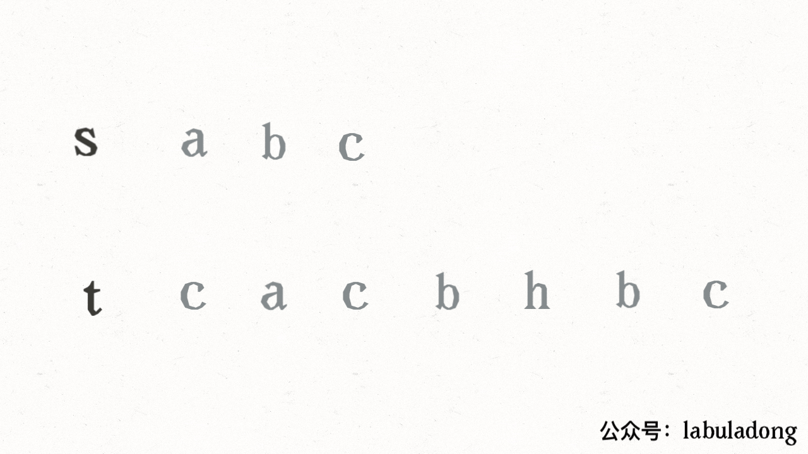

# Binary search

The problem is [leecode392](https://leetcode.com/problems/is-subsequence/) . A simple way is to set two points, and we go through two string with these two points like below.




Answer below:

```python
class Solution:
    def isSubsequence(self, s: str, t: str) -> bool:
        if len(s) > len(t):
            return False

        pointS = 0
        pointT = 0
        while pointS < len(s) and pointT < len(t):
            if s[pointS] == t[pointT]:
                pointS += 1
                pointT += 1
            else:
                pointT += 1
        return pointS == len(s)
```

Easily the complex is O(n) because we just need to traverse one time. **But things will be more complicated when the problem become**:


Suppose there are lots of incoming `s`, say `s1, s2, ..., sk` where `k >= 109`, and you want to check one by one to see if `t` has its subsequence. In this scenario, how would you change your code?


